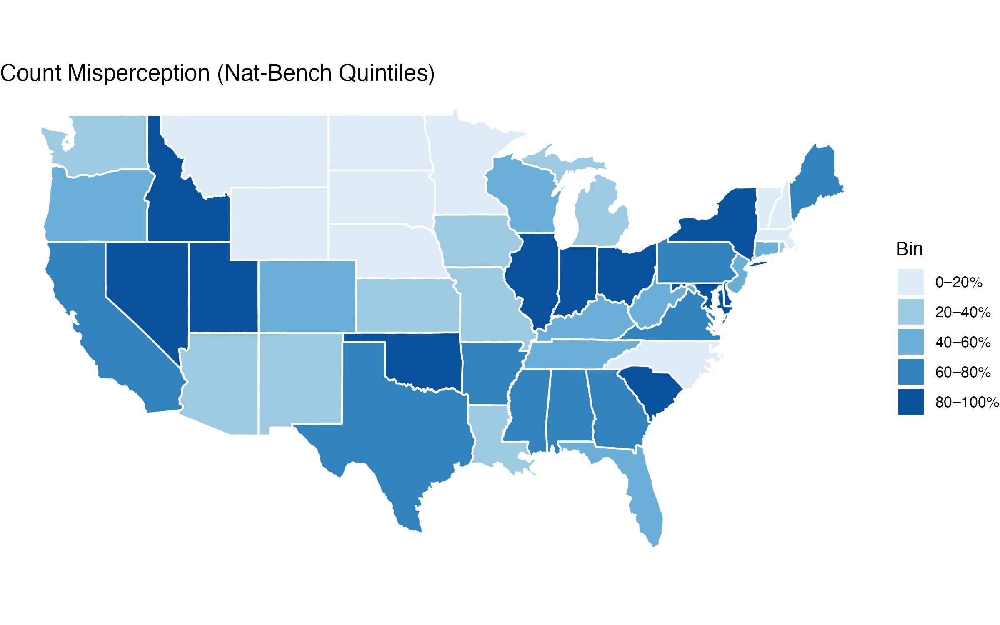
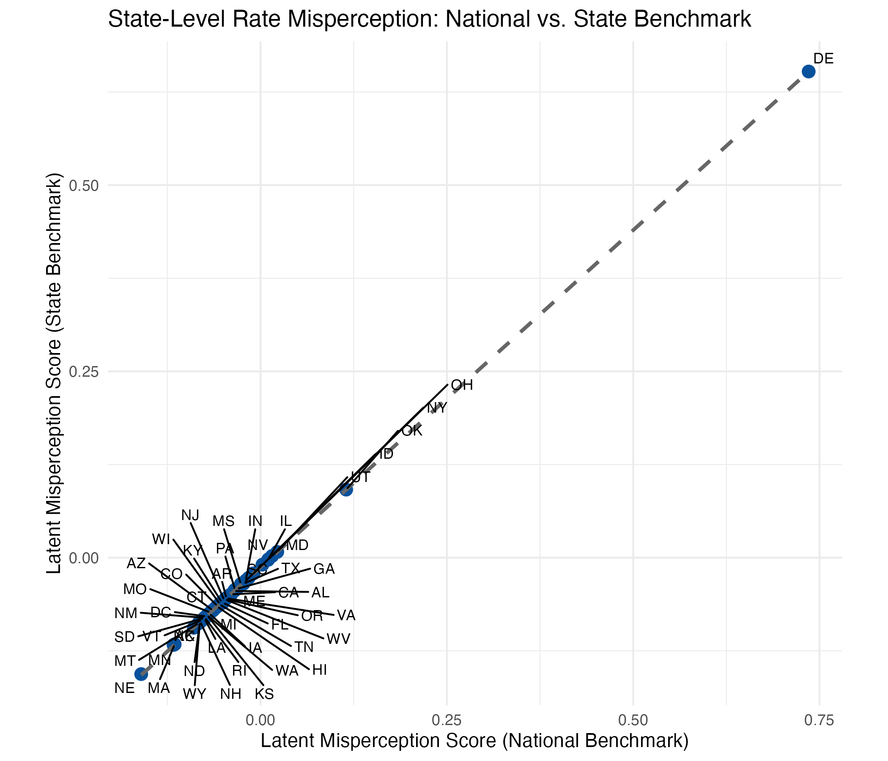

```{r setup, include=FALSE}
knitr::opts_chunk$set(echo = TRUE, warning = FALSE, message = FALSE, fig.align = "center")
```

**Author:**

- [Scott M. Mourtgos](https://smourtgos.netlify.app/)

**Based on data from a May 2025 nationally representative survey experiment.**


### What Do Americans Really Believe About Police Use of Force?

In May 2025, I fielded a nationally representative survey asking Americans to estimate the scale and racial disparities of police use of force in the United States. Specifically, respondents were asked:

- **"Out of all interactions with the police in the United States in a given year, what percentage (%) results in a police officer using force (physical or police weapon) against the individual?"**
(Response: 0%–100% slider)
- **"Based on what you know, how many people are killed by police gunfire in the United States every year?"**
(Response: Numeric input)
- **"Based on what you know, what percentage (%) of people killed by police every year in the United States are Black?"**
(Response: 0%–100% slider)
- **"Based on what you know, how many unarmed Black men are killed by police in the United States every year?"**
(Response: Numeric input)

Each respondent also provided geographic data, which allowed me to map responses to both **national** and **state-level** benchmarks on fatal police shootings (based on a decade’s worth of Washington Post data) as well as national estimates of use-of-force frequency from BJS data.[^1]

### From Raw Misperceptions to Meaningful Patterns

Based on past work, we know respondents are likely wrong on all four questions. But rather than treat each answer as a standalone error, I used factor analysis to identify **underlying dimensions of misperception**.

#### Two Latent Misperception Factors

Using exploratory and confirmatory factor analysis, I extracted two consistent patterns from the gaps between perception and reality:

- **Count Misperception**: Overestimation of _how many_ people are killed by police (including unarmed Black men and total gunfire deaths).
- **Rate Misperception**: Overestimation of _how often_ force is used and how racially disproportionate those killings are.[^2]

These factors allow us to compare misperceptions across geography—even if the benchmark data are imperfect (as we know they are). If official sources underreport or systematically bias use-of-force rates, these latent scores still capture **relative over- or underestimation** at the individual and state level.

### What the Nation Believes: Misperceptions vs. National Benchmarks

Before looking at geography, how far off are people on average?

- Respondents **overestimate the rate of police use of force** by **30.7 percentage points**.
- They **overestimate the number of people killed by police gunfire** by nearly **2,000 people**.
- They **overestimate the percentage of police killings involving Black individuals** by **25.5 percentage points**.
- They **overestimate the number of unarmed Black men killed** each year by approximately **550 people**.

```{r figure-Misperception-National-Benchmark, echo=FALSE}

```

This map shows each state's level of misperception by quintile using national benchmarks—**meaning states are grouped into five equal-sized bins based on their average misperception score**, from the least misinformed (lightest shade) to the most misinformed (darkest shade).[^3] 

The quintile classification helps highlight regional patterns in public beliefs, showing where respondents tend to most dramatically overestimate police use of force.

### Misperceptions vs. Local Reality

```{r figure-Misperception-State-Benchmark, echo=FALSE}
knitr::include_graphics("count_misperception_state_quintiles.png")
```

When we anchor responses to **local (state-level) benchmarks** instead of national averages, the geographic pattern of misperception remains stable. State-level misperception scores derived from national benchmarks are strongly correlated with those derived from state-specific benchmarks, indicating a consistent geographic pattern regardless of the reference point.

```{r figure-National-vs-State, echo=FALSE}

```

### Why These Findings Matter

Public opinion about policing is often shaped by high-profile, nationally visible events. But most people interact with local police, not a national aggregate.

If misperceptions are fueling distrust, driving specific reforms, or shaping media narratives, it’s critical to understand:

- **Where people are most misinformed**
- **How far those beliefs deviate from reality**
- **Whether those beliefs reflect local or national conditions**

### Future Work

These findings raise important questions for future research. While misperceptions about police use of force are widespread, we still know little about **what shapes these beliefs**. Future work should explore:

- **Media and Information Sources**: To what extent do national media narratives drive these misperceptions? Does exposure to local crime coverage or firsthand police interactions moderate them?
_Hopefully more on this in the near future with forthcoming work._
- **Corrective Interventions**: Can targeted, localized information shift these beliefs—or are they resistant to correction?
- **Consequences of Misperceptions**: How do inflated beliefs about police use of force affect attitudes toward reform, trust in law enforcement, or support for policy changes?
- **Temporal Trends**: Are these misperceptions stable over time, or do they fluctuate with major incidents or political cycles?

Addressing these questions is essential to developing evidence-based strategies for fostering constructive dialogue about policing in America.


>Citation: Mourtgos, S. M. (2025). Mapping Public Misperceptions of Police Use of Force. [Link](https://smourtgos.netlify.app/post/misperceptions-police-force/)

[^1]: The fatal police shootings data used in this analysis come from the Washington Post’s Police Shootings Database (2015–2024). While no single dataset on police use of force in the U.S. is comprehensive or free from limitations—including this one—it provides a sufficiently consistent and well-documented benchmark for estimating relative misperceptions across states.
Estimates for non-lethal use of force are drawn from the Bureau of Justice Statistics (BJS), which suggests that approximately 1.5% of all police-public interactions involve force. To be conservative—and to ensure that overestimation patterns aren’t artificially inflated—I use 2% as the benchmark for force estimates. This figure, however, is based entirely on self-report survey data, and unlike the other three measures (fatal gunfire, racial disparity, and unarmed deaths), there is no state-level benchmark available. As such, the use-of-force comparison is necessarily anchored to a national estimate.
This analysis does not depend on the accuracy of any single number. Instead, it focuses on the discrepancy between public perceptions and benchmarked figures, which provides an adequate approach, even if the underlying data contain some degree of error or underreporting.
[^2]: I z-scored all four measures and estimated the same EFA and CFA models. The results were consistent even when all four measures were placed on the same scale.
[^3]: Each state's misperception score across the two factors is highly correlated, so only one is shown here.
